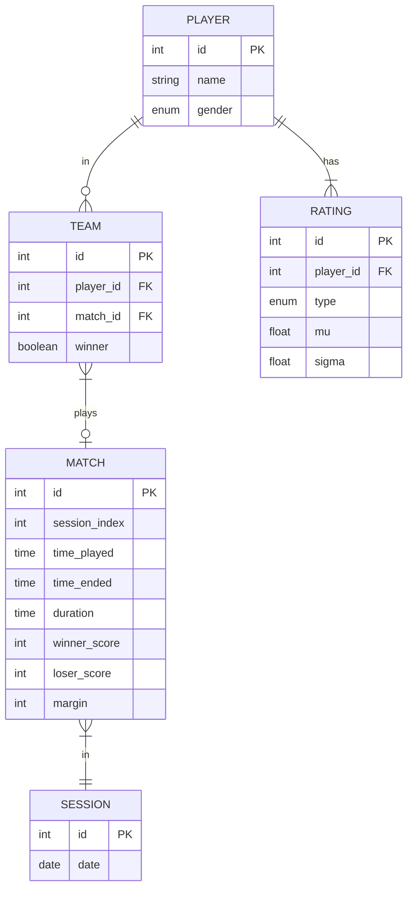

```mermaid
---
config:
  theme: default
---
erDiagram
    PLAYER ||--o{ TEAM: in
    PLAYER ||--|{ RATING: has
    TEAM }|--o| MATCH: plays
    MATCH }|--|| SESSION: in

    PLAYER {
        int id PK
        string name
        enum gender
    }
    RATING {
        int id PK
        int player_id FK
        enum type
        float mu
        float sigma
    }
    TEAM {
        int id PK
        int player_id FK
        int match_id FK
        boolean winner
    }
    MATCH {
        int id PK
        int session_index
        time time_played
        time time_ended
        time duration
        int winner_score
        int loser_score
        int margin
    }
    SESSION {
        int id PK
        date date
    }
```
